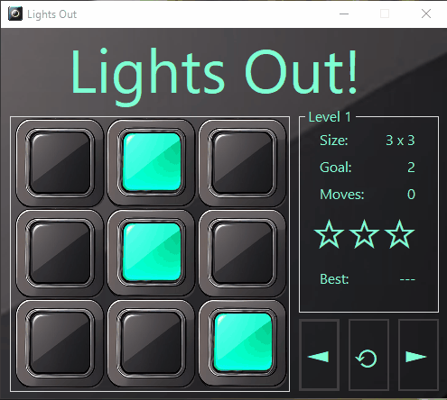

# Lights Out
This is an implementation of the game "Lights Out" in built with Windows Forms.

## Overview

Lights Out is a digital game released in 1995 by Tiger Electronics. The original design featured a 5 by 5 grid of lights. When the game starts the lights are randomly toggled on or off. Pressing any light will toggle its state and its neighbors state (On => Off, Off => On). The objective is turn off all of the lights with as few clicks as possible.

## Game Play



Levels are stored in .json format With Level number, Level size (3 for a 3x3 board), Minimum moves, which would be the least number of moves used to beat the level, BestScore to keep a record of hte least moves used to beat the level, Stars which is used to display up to three stars on the UI, 3 is the best 0 is the worst, a Name field used to display level name on the UI, and a array of integers called board, this is used for the initial condition (0 is Off and 1 is On).
```json
{
    "Level": 1,
    "Size": 3,
    "MinMoves": 2,
    "BestScore": 9000,
    "Stars": 0,
    "Board": [
    0,
    1,
    0,
    0,
    1,
    0,
    0,
    0,
    1
    ],
    "Name": "Level 1",
    "StarText": "☆☆☆"
}
```

This data is read from disk and deserialized into an c# struct.
```cs
public struct LevelData
{
    /// <summary>Return "Level {level}" Ex: "Level 1".</summary>
    public readonly string Name => $"Level {Level}";
    /// <summary>The number of this level. Ex: Level 1.</summary>
    public int Level;
    /// <summary>Size of board Ex: Size = 4 => 4x4 board.</summary>
    public int Size;
    /// <summary>Minimum moves required to complete the level.</summary>
    public int MinMoves;
    /// <summary>The minimum number of moves used to beat this level. 9000 to begin.</summary>
    public int BestScore = 9000;
    /// <summary>The number of Stars earned for this level. 0 to begin.</summary>
    public int Stars = 0;
    /// <summary>Integer array representing a data model of the Board.</summary>
    public int[] Board = [];
```
Some additional functionality is added to the struct by way of properties and methods.
```cs
/// <summary>
/// Update Board data to match the View data. 
/// </summary>
/// <param name="lights">Array of Lights that is the interactive View.</param>
public readonly void UpdateBoard(Light[] lights)
{
    foreach (var light in lights)
    {
        Board[light.Index] = (int)light.State;
    }
}

/// <summary>
/// Get a UI friendly string of stars based on number of stars earned for this level.
/// Ex: Stars = 2, StarText = "★★☆"
/// </summary>
public readonly string StarText =>

    this.Stars switch
    {
        0 => "☆☆☆",
        1 => "★☆☆",
        2 => "★★☆",
        3 => "★★★",
        _ => "☆☆☆",
    };
```
All levels are stored an a larger json object.

```json
{
  "Levels": [
    {
      "Level": 1,
      "Size": 3,
      "MinMoves": 2,
      "BestScore": 9000,
      "Stars": 0,
      "Board": [
        0,
        1,
        0,
        0,
        1,
        0,
        0,
        0,
        1
      ],
      "Name": "Level 1",
      "StarText": "☆☆☆"
    },
    {
      "Level": 2,
      "Size": 3,
      "MinMoves": 3,
      "BestScore": 9000,
      "Stars": 0,
      "Board": [
        0,
        1,
        0,
        1,
        1,
        0,
        1,
        1,
        1
      ],
      "Name": "Level 2",
      "StarText": "☆☆☆"
    }
}
```
Which is held in a simple struct, LevelDatabase. Which just has a List of LevelData and a index accessor.
```cs
/// <summary>
/// Container for all LevelData.
/// </summary>
public struct LevelDatabase : IDatabase
{
    /// <summary>
    /// List of all pre-made LevelData. Levels are initialized with this data.
    /// </summary>
    public List<LevelData> Levels { get; set; }

    /// <summary>
    /// Get level from database by index.
    /// </summary>
    /// <param name="index">Index of level in list. Ex: Level 1 index is 0</param>
    /// <returns>The LevelData at the selected index.</returns>
    public readonly LevelData this[int index] => Levels[index];

    /// <summary>
    /// Default constructor.
    /// </summary>
    public LevelDatabase()
    {
        Levels = [];
    }
}
```
This data is loaded from disk when the game starts and all Levels are based off this initial state.


And extension method helps load the data.
```cs
public static class DatabaseExtensions
{
    /// <summary>
    /// Load game data from disk for this LevelDatabase Object.
    /// </summary>
    /// <param name="gameDb">this level database</param>
    /// <returns></returns>
    public static LevelDatabase LoadLevelDatabase(this LevelDatabase gameDb)
    {
        return gameDb.LoadDatabase<LevelDatabase>("Game.json");
    }

    ...

    /// <summary>
    /// Load database from disk.
    /// </summary>
    /// <typeparam name="T">LevelDatabase or UserDatabase.</typeparam>
    /// <param name="db">this database</param>
    /// <param name="databaseName">database name in .json format: User.json or Game.json.</param>
    /// <returns></returns>
    private static T LoadDatabase<T>(this T db, string databaseName)
    {
        string jsonString;
        using (var streamReader = new StreamReader(FileUtil.GetLevelDatabase(databaseName)))
        {
            jsonString = streamReader.ReadToEnd();
        }
        return JsonConvert.DeserializeObject<T>(jsonString);
    }
}
```

Used like:
```cs
private LevelDatabase game = new LevelDatabase().LoadLevelDatabase();
```
### Level Saving

User data is managed in a similar way. A UserDatabase struct holds the data like the LevelDatabase struct, but with some extra functionality for updating and adding data.
```cs
/// <summary>
/// Database for holding user save data for each level and general game play.
/// </summary>
public struct UserDatabase : IDatabase
{
    /// <summary>
    /// List of LevelData. Holds users save data for each level.
    /// </summary>
    public List<LevelData> Levels { get; set; }
    /// <summary>
    /// The index of the current level in the database.
    /// </summary>
    public int SelectedIndex { get; set; } = 0;
    /// <summary>
    /// The maximum index selectable in the database. Indicates highest unlocked level.
    /// </summary>
    public int MaxIndex { get; set; } = 0;
    /// <summary>
    /// The current selected level.
    /// </summary>
    public LevelData CurrentLevel => Levels[SelectedIndex];
    /// <summary>
    /// Get level from database by index.
    /// </summary>
    /// <param name="index">Index of level in list. Ex: Level 1 index is 0/</param>
    /// <returns>The LevelData at the selected index.</returns>
    public LevelData this[int index]
    {
        get
        {
            return Levels[index];
        }
        set { 
            Levels[SelectedIndex] = value;
        }
    }
```
Its .json data is as follows. This is the initial state for a new user. One level is added to Levels and its at the initial state. Once played this data is updated and upon beating a level the next level is added to the list. The current level that is selected when the user closes the application is stored and is loaded back when the user plays again. 
```json
{
  "Levels": [
    {
      "Level": 1,
      "Size": 3,
      "MinMoves": 2,
      "BestScore": 9000,
      "Stars": 0,
      "Board": [
        0,
        1,
        0,
        0,
        1,
        0,
        0,
        0,
        1
      ],
      "Name": "Level 1",
      "StarText": "☆☆☆"
    }
  ],
  "SelectedIndex": 0,
  "MaxIndex": 0,
  "CurrentLevel": {
      "Level": 1,
      "Size": 3,
      "MinMoves": 2,
      "BestScore": 9000,
      "Stars": 0,
      "Board": [
        0,
        1,
        0,
        0,
        1,
        0,
        0,
        0,
        1
      ],
      "Name": "Level 1",
      "StarText": "☆☆☆"
    }
}
```
Like the LevelDatabase, the UserDatabase is loaded via an extension method:
```cs
/// <summary>
/// Static class for Database extensions for loading database info from disk.
/// </summary>
public static class DatabaseExtensions
{
    ...

    /// <summary>
    /// Load user data from disk for this UserDatabase Object.
    /// </summary>
    /// <param name="userDb">this user database</param>
    /// <returns></returns>
    public static UserDatabase LoadUserDatabase(this UserDatabase userDb)
    {
        return userDb.LoadDatabase<UserDatabase>("User.json");
    }

    /// <summary>
    /// Load database from disk.
    /// </summary>
    /// <typeparam name="T">LevelDatabase or UserDatabase.</typeparam>
    /// <param name="db">this database</param>
    /// <param name="databaseName">database name in .json format: User.json or Game.json.</param>
    /// <returns></returns>
    private static T LoadDatabase<T>(this T db, string databaseName)
    {
        string jsonString;
        using (var streamReader = new StreamReader(FileUtil.GetLevelDatabase(databaseName)))
        {
            jsonString = streamReader.ReadToEnd();
        }
        return JsonConvert.DeserializeObject<T>(jsonString);
    }
}
```
Used like:
```cs
private UserDatabase user = new UserDatabase().LoadUserDatabase();

```

All data is managed via a DataHandler object which loads all data from disk, maintains current level and performs any logic required to determine which LevelData is returned and how to update user data and save to disk.
```cs
/// <summary>
/// Class for handling game data. 
/// Loading data from disk,
/// Incrementing and decrement level,
/// Updating user progress,
/// Saving data to disk.
/// </summary>
public class DataHandler()
{
    /// Load UserDatabase and GameDatabase from disk.
    private UserDatabase user = new UserDatabase().LoadUserDatabase();
    private LevelDatabase game = new LevelDatabase().LoadLevelDatabase();
        
    ...

```
## Development

### Level Generation

### Solver


## Debug Options